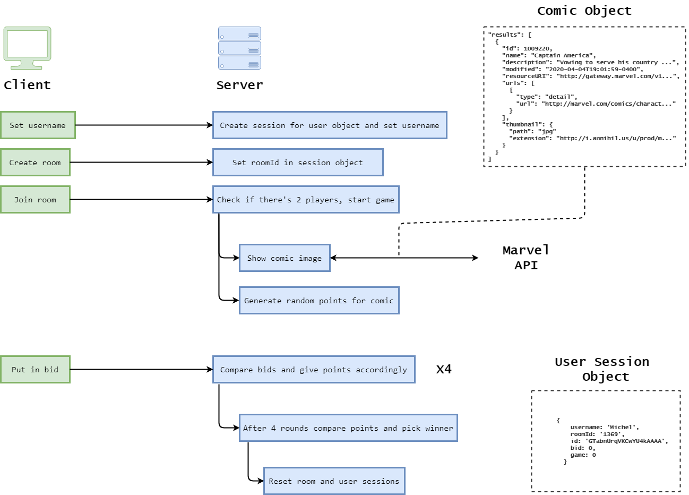

# RTW1920 | Comic Bidding War


In this real-time application 2 players can battle against eachother, bidding on a comic that gives a certain amount of points. The player with most points wins the game. Images for comics are retrieved from the Marvel API.

## Features
- Real-time application
- Multiplayer round based game
- Create rooms
- Game starts when there's 2 players in the room
- Achieve points based on bidding
- Session storage of certain data

## Data Life Cycle


## Events
- `bid` save bid in user object and shows bids
- `endOfGame` decides when game ends and shows win/lose message
- `redirect` resets room and users
- `disconnect` resets room and users
- `players` displays players
- `sendCard` displays comic card
- `message` displays points
- `opponentBid` displays opponents bid
- `endResult` displays end result

## Code examples
- Fetching a 'random' Marvel comic, picked from 10 pre-set id's
```
exports.getCard = async function() {
	const comics = [375, 10, 264, 21, 114, 229, 37, 342, 45, 48];
	const randomComic = comics[Math.floor(Math.random() * comics.length)];
	const fetchUrl = `http://gateway.marvel.com/v1/public/comics/${randomComic}?ts=${timestamp}&apikey=${publicKey}&hash=${hash}`;

	return await fetch(fetchUrl)
		.then(res => {
			return res.json();
		})
		.then(data => {
			const detail = data.data.results[0];
			const url = `${detail.thumbnail.path}.${detail.thumbnail.extension}`;
			const points = getPoints();
			return { image: url, points: points };
		});
};
```

- Deciding who wins/loses the round or if it's a tie, give points accordingly.
```
exports.getResult = (players, cards) => {
	const points = cards[cards.length - 1].points;
	const answers = players.map(player => player.bid);
	const tie = Object.is(answers[0], answers[1]);

	if (tie) {
		return players;
	} else {
		const winner = players.reduce((max, game) =>
			max.bid > game.bid ? max : game
		);
		winner.game += points;
		return players;
	}
};
```

- Deciding who wins/loses the game or if it's a tie
```
exports.getEndResult = players => {
	const points = players.map(player => player.game);
	const tie = Object.is(points[0], points[1]);
	if (tie) {
		return players;
	} else {
		const finalWinner = players.reduce((prev, current) => {
			return prev.game > current.game ? prev : current;
		});
		return finalWinner;
	}
};
```

## Dependencies

```
"dependencies": {
    "body-parser": "^1.19.0",
    "dotenv": "^7.0.0",
    "ejs": "^2.6.1",
    "express": "^4.16.4",
    "express-session": "^1.17.0",
    "express-socket.io-session": "^1.3.5",
    "md5": "^2.2.1",
    "node-fetch": "^2.6.0",
    "socket.io": "^2.2.0"
  },
  "devDependencies": {
    "nodemon": "^1.18.11"
  }
```

## API
This web-app was made by making use of the Marvel API. The Marvel API allows developers everywhere to access information about Marvel's vast library of records what's coming up, to 70 years ago, 3000 calls can be made daily. Documentation can be found [here](https://developer.marvel.com/docs).

To fetch server side the API requires a md5 hash consisting of a timestamp, public key and private key.

In our case only the comics are used for the application. The provided object can be seen below, it has been mapped to only get certain properties.
```
"results": [
  {
    "id": "int",
    "name": "string",
    "description": "string",
    "modified": "Date",
    "resourceURI": "string",
    "urls": [
      {
        "type": "string",
        "url": "string"
      }
    ],
    "thumbnail": {
      "path": "string",
      "extension": "string"
    }
  }
]
```

## Install
Follow the steps beneath to run this app locally.
1. Clone repo
    ```
    $ git clone https://github.com/mich97/real-time-web-1920.git
    ```
2. Install dependencies
    ```
    $ npm install
    ``` 
3. Run
    ```
    $ npm run dev
    ```
4. Open following url in browser
    ```
   localhost:3000
   ```