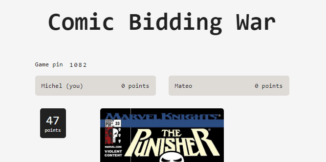
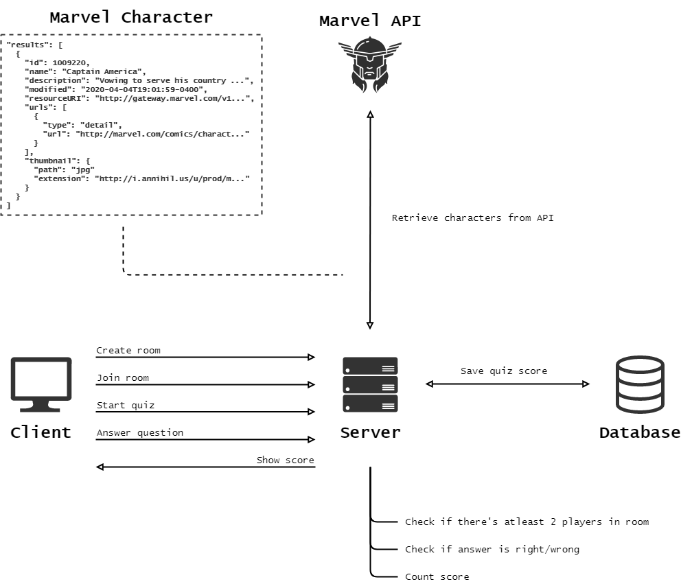

# RTW1920 | Marvel Quiz


First concept of my real-time application. The idea is to create a Kahoot like quiz game where the Marvel API is used to retrieve certain data. Players will be able to sign in, when the quiz starts it shall display a Marvel character. The players will have to guess the Marvel character.

## Events
- `room-created` creates room
- `new-user` join message
- `user-connected` broadcasts another player joining
- `send-chat-message` sending chat messages
- `chat-message` broadcasts messages
- `ronde-message` broadcasts the number of the round
- `correct-message` player getting answer correct
- `update-score` updates scores after correct answer
- `newImage` update image on new round
- `game-over` game is over after all 5 rounds and room gets deleted
- `user-disconnected` broadcasts user disconnecting

## Dependencies

```
  "dependencies": {
    "body-parser": "^1.19.0",
    "compression": "^1.7.4",
    "dotenv": "^8.2.0",
    "ejs": "^3.1.3",
    "express": "^4.17.1",
    "express-handlebars": "^4.0.3",
    "express-minify-html-2": "^1.0.1",
    "http": "0.0.1-security",
    "md5": "^2.2.1",
    "node-fetch": "^2.6.0",
    "socket.io": "^2.3.0"
  },
  "devDependencies": {
    "browser-sync": "^2.26.7",
    "eslint": "^6.8.0",
    "gulp": "^4.0.2",
    "gulp-clean-css": "^4.3.0",
    "gulp-sass": "^4.1.0",
    "nodemon": "^2.0.4",
    "rimraf": "^3.0.2"
  }
```

## Features
- Multiplayer round based quiz
- Create room
- Game starts when there's 2 players in the room
- Achieve points based on answer
- Server messages to notice players

## Install
Follow the steps beneath to run this app locally.
1. Clone repo
    ```
    $ git clone https://github.com/mich97/real-time-web-1920.git
    ```
2. Install dependencies
    ```
    $ npm install
    ``` 
3. Run
    ```
    $ npm run dev
    ```
4. Open following url in browser
    ```
   localhost:3000
   ```

## API
This web-app was made by making use of the Marvel API. The Marvel API allows developers everywhere to access information about Marvel's vast library of records what's coming up, to 70 years ago, 3000 calls can be made daily. Documentation can be found [here](https://developer.marvel.com/docs).

To fetch server side the API requires a md5 hash consisting of a timestamp, public key and private key.

In our case only the characters are used for the application. The provided object can be seen below, it has been mapped to only get certain properties.
```
"results": [
  {
    "id": "int",
    "name": "string",
    "description": "string",
    "modified": "Date",
    "resourceURI": "string",
    "urls": [
      {
        "type": "string",
        "url": "string"
      }
    ],
    "thumbnail": {
      "path": "string",
      "extension": "string"
    }
  }
]
```

## Data Life Cycle
