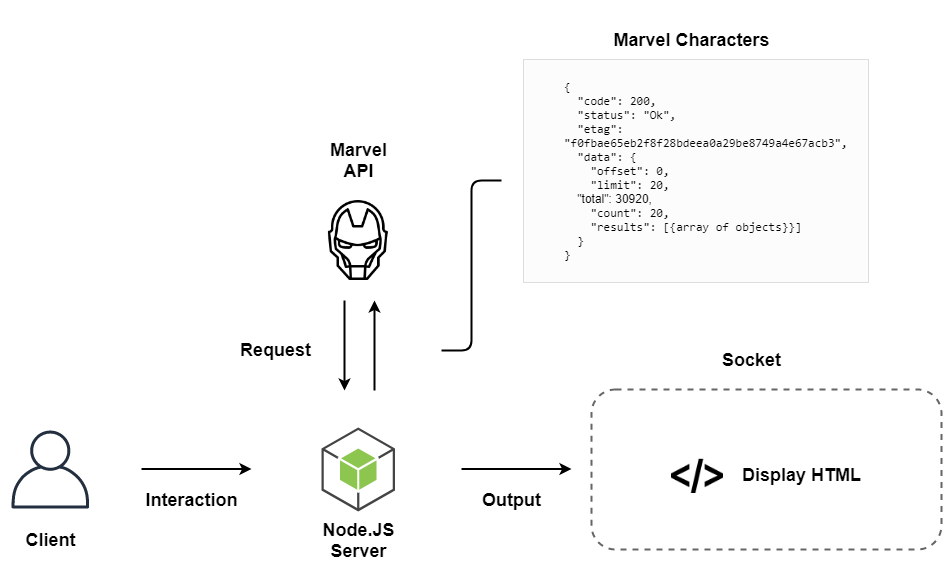

# RTW1920 | Marvel Quiz
First concept of my real-time application. The idea is to create a Kahoot like quiz game where the Marvel API is used to retrieve certain data. Players will be able to sign in, when the quiz starts it shall display a Marvel character. The players will have to guess the Marvel character, this will probably be multiple choice.

## Install
Follow the steps beneath to run this app locally.
1. Clone repo
    ```
    $ git clone https://github.com/mich97/real-time-web-1920.git
    ```
2. Move to directory
    ```
    $ cd real-time-web-1920/quiz-app
    ```
3. Install dependencies
    ```
    $ npm install
    ``` 
4. Run
    ```
    $ npm run dev
    ```
5. Open following url in browser
    ```
   localhost:3000
   ```

## Features
- Multiplayer quiz, probably multiple choice
- Display list of participating users
- Achieve points based on answer and speed
- Display score during quiz
- Display leaderboard at end

## API
Data of characters that players have to guess is retrieved from the [Marvel API](https://developer.marvel.com/).

## Data Life Cycle
