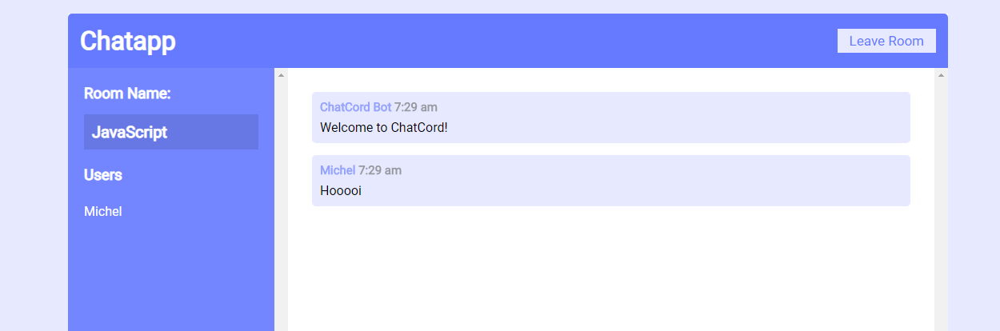

# RTW1920 | Chatapp

Demo-app of the first weeks assigment, a real time web-chat.

## Live Demo
[Link](https://rtw-michel.herokuapp.com/)

## Features
- Set username
- Multiple chatrooms
- Realtime chatting
- Overview of active users

## Dependencies
The following (dev-)dependencies are being used:
```
  "dependencies": {
    "express": "^4.17.1",
    "moment": "^2.24.0",
    "socket.io": "^2.3.0"
  },
  "devDependencies": {
    "nodemon": "^2.0.2"
  }
```

## Install
Follow the steps beneath to run this app locally.
1. Clone repo
    ```
    $ git clone https://github.com/mich97/real-time-web-1920.git
    ```
2. Move to directory
    ```
    $ cd real-time-web-1920
    ```
3. Install dependencies
    ```
    $ npm install
    ``` 
4. Run
    ```
    $ npm run dev
    ```
5. Open following url in browser
    ```
   localhost:3000
   ```
   
## Credits
The following resources were used to develop this app:
- [Build a Real Time Chat App With Node.js And Socket.io](https://www.youtube.com/watch?v=rxzOqP9YwmM&t=18s)
- [Realtime Chat With Users & Rooms - Socket.io, Node & Express](https://www.youtube.com/watch?v=jD7FnbI76Hg)
- Lectures and live coding session from Laurens/Guido
